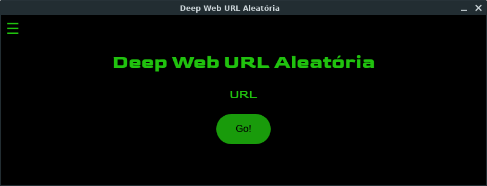

# deep-web-url-aleatoria

<p align="center">
  
</p>

<p align="center">
  <a href="https://forthebadge.com">  </a>
  <a href="https://forthebadge.com">  </a>
  <a href="https://forthebadge.com">  </a>
</p>

## :scroll: Sobre

Recriação do aplicativo deep-web-url-aleatoria, inicialmente feito em Python (Tkinter) agora em JavaScript (Electron), que mostra uma URL aleatória da Deep Web.

Se no programa ter URLs "ilegais" ou conteúdo impróprio, como pornografia e gore, avise-me se possível.

*Obs.1: atualmente o executável só está disponível para Linux.*

---

## :rocket: Tecnologias utilizadas

- HTML
- CSS
- JavaScript (Electron)

---

## :computer: Como baixar e rodar o programa

```php
  // Clonar o repositório
  $ git clone https://github.com/jjoaovitor7/dw-url-aleatoria

  // Entrar no diretório
  $ cd dw-url-aleatoria
  $ cd deep-web-url-aleatoria-linux-x64

  // Executar o programa
  $ ./deep-web-url-aleatoria
```

---
